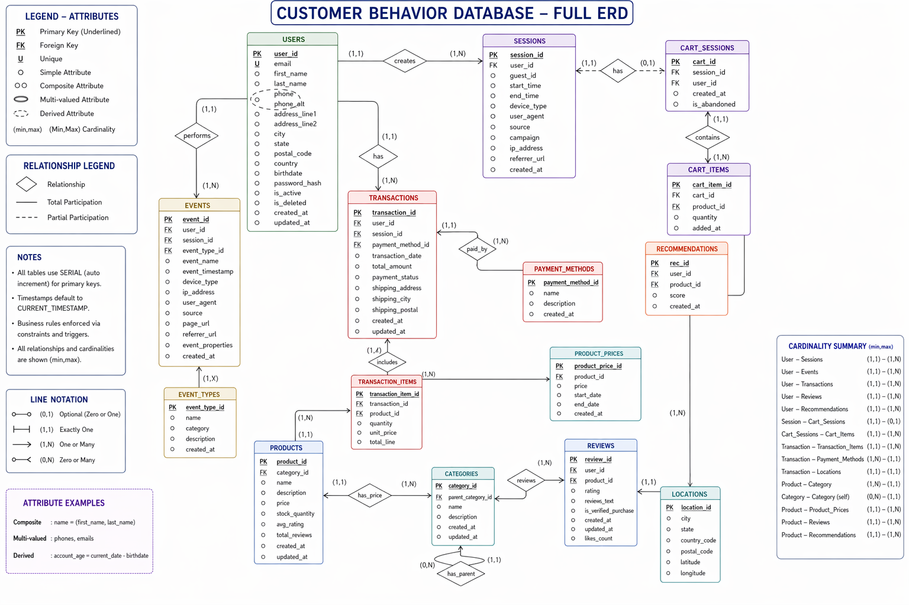

# NHA-4-78
# customer_behavior-analysis
Designed a fully normalized relational database for a real-time customer behavior analytics system including users, products, events, transactions, payments, and recommendation engine with enforced business constraints and weak entity modeling.

# Customer Behavior Database – ERD Overview
# ERD Diagram

# Overview

Entity-Relationship Diagram (ERD) for a customer behavior tracking system, designed to model user interactions, transactions, products, and shopping sessions in an e-commerce environment.

## 🗺️ ERD Diagram

---

## Legend & Notation

### Attribute Types
| Symbol | Meaning |
|--------|---------|
| **PK** | Primary Key (Underlined in diagram) |
| **FK** | Foreign Key |

